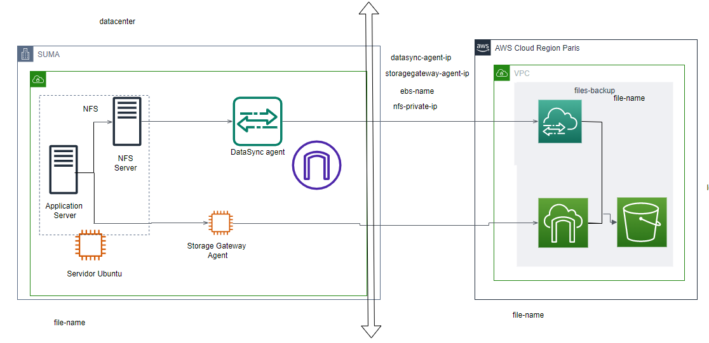

# files_backup_aws

En este repo se pracitca con la creación de una arquitectura en aws.

- 1. Se crear un provider-main.tf donde se inicia una isntancia de ejemplo
- 2. Se crea un storage gateway
- 3. Se crea un datasync

Testing: se comprueba lo siguiente en la siguiente arquitectura

- 1. Se crea un fichero de nombre file_name